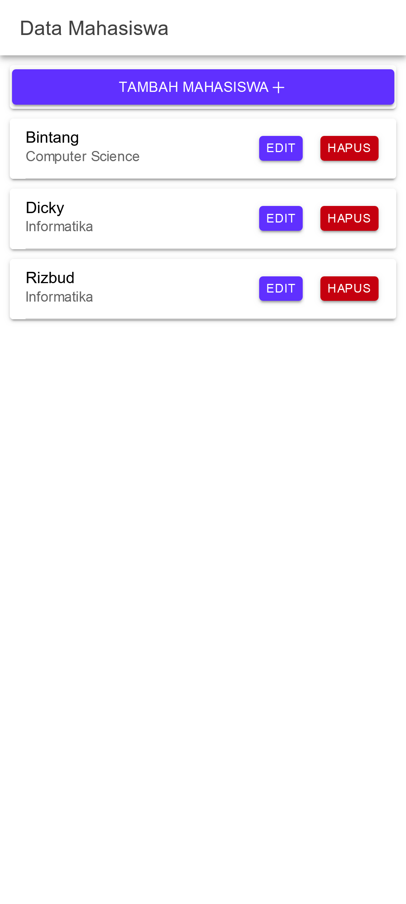
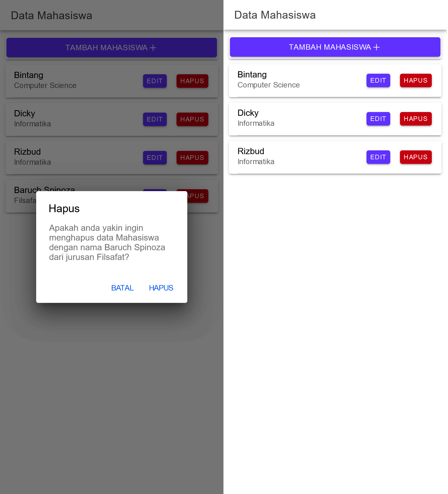

# Tugas 8 Praktikum Pemrograman Mobile

```yml
Nama: Panky Bintang Pradana Yosua
NIM: H1D022077
Shift Baru: F
Shift Lama: D
```

CRUD CRUD CRUD

## Table of Contents

- [Tugas 8 Praktikum Pemrograman Mobile](#tugas-8-praktikum-pemrograman-mobile)
  - [Table of Contents](#table-of-contents)
  - [1. Routing](#1-routing)
  - [2. API Service](#2-api-service)
  - [3. Mahasiswa](#3-mahasiswa)
    - [3.1 Module Mahasiswa](#31-module-mahasiswa)
    - [3.2 Mahasiswa](#32-mahasiswa)
    - [3.2 Tambah Mahasiswa](#32-tambah-mahasiswa)
    - [3.3 Edit Mahasiswa](#33-edit-mahasiswa)
    - [3.4 Hapus Mahasiswa](#34-hapus-mahasiswa)

## 1. Routing

Routing Aplikasi didefinisikan pada file `src\app\app-routing.module.ts`

```ts
import { NgModule } from "@angular/core";
import { PreloadAllModules, RouterModule, Routes } from "@angular/router";

const routes: Routes = [
  {
    path: "",
    redirectTo: "mahasiswa",
    pathMatch: "full",
  },
  {
    path: "mahasiswa",
    loadChildren: () => import("./mahasiswa/mahasiswa.module").then((m) => m.MahasiswaPageModule),
  },
];

@NgModule({
  imports: [RouterModule.forRoot(routes, { preloadingStrategy: PreloadAllModules })],
  exports: [RouterModule],
})
export class AppRoutingModule {}
```

## 2. API Service

API Service pada aplikasi ini memiliki 6 fungsi.

- `apiURL`:
  - Mengembalikan URL dasar API yang akan digunakan untuk setiap permintaan
  - Pengembalian: string - URL dasar API.
- `tambah`: Menambahkan data baru ke backend melalui metode HTTP POST.
- `edit`: Mengedit data di backend melalui metode HTTP PUT.
- `tampil`: Mengambil data dari backend melalui metode HTTP GET.
- `hapus`: Menghapus data di backend melalui metode HTTP DELETE.
- `lihat`: Menampilkan detail data tertentu berdasarkan id melalui metode HTTP GET.

```ts
import { Injectable } from "@angular/core";
import { HttpClient } from "@angular/common/http";
import { Observable } from "rxjs";

@Injectable({
  providedIn: "root",
})
export class ApiService {
  constructor(private http: HttpClient) {}

  apiURL() {
    return "http://localhost/ionic_crud";
  }

  tambah(data: any, endpoint: string) {
    return this.http.post(this.apiURL() + "/" + endpoint, data);
  }

  edit(data: any, endpoint: string) {
    return this.http.put(this.apiURL() + "/" + endpoint, data);
  }

  tampil(endpoint: string): Observable<any> {
    return this.http.get(this.apiURL() + "/" + endpoint);
  }

  hapus(id: any, endpoint: string) {
    return this.http.delete(this.apiURL() + "/" + endpoint + "" + id);
  }

  lihat(id: any, endpoint: string) {
    return this.http.get(this.apiURL() + "/" + endpoint + "" + id);
  }
}
```

## 3. Mahasiswa

### 3.1 Module Mahasiswa

Module mahasiswa memanggil `CommonModule`, `FormsModule`, `IonicModule`, dan `MahasiswaPageRoutingModule`, serta memiliki Page dalam declaration bernama `MahasiswaPage`.

```ts
import { NgModule } from "@angular/core";
import { CommonModule } from "@angular/common";
import { FormsModule } from "@angular/forms";

import { IonicModule } from "@ionic/angular";

import { MahasiswaPageRoutingModule } from "./mahasiswa-routing.module";

import { MahasiswaPage } from "./mahasiswa.page";

@NgModule({
  imports: [CommonModule, FormsModule, IonicModule, MahasiswaPageRoutingModule],
  declarations: [MahasiswaPage],
})
export class MahasiswaPageModule {}
```

### 3.2 Mahasiswa

Halaman mahasiswa dirender dengan Component MahasiswaPage `src\app\mahasiswa\mahasiswa.page.ts` dari template `src\app\mahasiswa\mahasiswa.page.html`

Komponen ini digunakan untuk menampilkan daftar mahasiswa, mengambil data mahasiswa berdasarkan ID, dan menangani proses tampilan modal untuk menambah atau mengedit data mahasiswa.

Terdapat beberapa properti yang digunakan pada halaman mahasiswa.

- `dataMahasiswa`: Menyimpan data mahasiswa yang diterima dari API.
- `modalTambah`: Menyimpan referensi modal untuk menambah data mahasiswa (tidak digunakan dalam cuplikan kode).
- `id`: Menyimpan ID mahasiswa yang sedang dipilih.
- `nama`: Menyimpan nama mahasiswa yang sedang dipilih.
- `jurusan`: Menyimpan jurusan mahasiswa yang sedang dipilih.
- `modalEdit`: Menyimpan referensi modal untuk mengedit data mahasiswa (tidak digunakan dalam cuplikan kode).

Untuk mount pertama kali akan memanggil method `getMahasiswa` pada `ngOnInit`. Data mahasiswa akan diambil dari API, state dataMahasiswa terisi, setelah itu dirender pada html.

```ts
import { Component, OnInit } from "@angular/core";
import { ApiService } from "../service/api.service";
import { AlertController, ModalController } from "@ionic/angular";
import { logoIonic } from "ionicons/icons";
import { addIcons } from "ionicons";

@Component({
  selector: "app-mahasiswa",
  templateUrl: "./mahasiswa.page.html",
  styleUrls: ["./mahasiswa.page.scss"],
})
export class MahasiswaPage implements OnInit {
  dataMahasiswa: any;
  modalTambah: any;
  id: any;
  nama: any;
  jurusan: any;
  modalEdit: any;

  constructor(private api: ApiService, private modal: ModalController, private alert: AlertController) {
    addIcons({ logoIonic });
  }

  ngOnInit() {
    this.getMahasiswa();
  }

  getMahasiswa() {
    this.api.tampil("tampil.php").subscribe({
      next: (res: any) => {
        console.log("sukses", res);
        this.dataMahasiswa = res;
      },
      error: (err: any) => {
        console.log(err);
      },
    });
  }
}
```

Setelah itu akan dirender dengan looping dataMahasiswa, diwakilkan dengan variable item.

```html
<ion-card *ngFor="let item of dataMahasiswa">
  <ion-item>
    <ion-label>
      {{item.nama}}
      <p>{{item.jurusan}}</p>
    </ion-label>
    <ion-button expand="block" (click)="openModalEdit(true,item.id)" color="tertiary">Edit</ion-button>
    <ion-button id="hapus-mahasiswa" color="danger" slot="end" (click)="konfirmasiHapus({id: item.id, nama: item.nama, jurusan: item.jurusan})">Hapus</ion-button>
  </ion-item>
</ion-card>
```



### 3.2 Tambah Mahasiswa

Halaman mahasiswa menggunakan beberapa function di bawah ini

- `resetModal()` Untuk mereset setelah menambahkan mahasiswa supaya ketika menambahkan, data mahasiswa yang telah ditambah hilang dari modal.
- `tambahMahasiswa()` Akan ditrigger setelah tombol `TAMBAH MAHASISWA` pada modal tambah mahasiswa diklik.

```ts
resetModal() {
  this.id = null;
  this.nama = '';
  this.jurusan = '';
}

tambahMahasiswa() {
  if (this.nama != '' && this.jurusan != '') {
    let data = {
      nama: this.nama,
      jurusan: this.jurusan,
    };
    this.api.tambah(data, 'tambah.php').subscribe({
      next: (hasil: any) => {
        this.resetModal();
        console.log('berhasil tambah mahasiswa');
        this.getMahasiswa();
        this.modalTambah = false;
        this.modal.dismiss();
      },
      error: (err: any) => {
        console.log('gagal tambah mahasiswa');
      },
    });
  } else {
    console.log('gagal tambah mahasiswa karena masih ada data yg kosong');
  }
}

cancel() {
  this.modal.dismiss();
  this.modalTambah = false;
  this.modalEdit = false;
  this.resetModal();
}
```

Berikut adalah kode html yang merender button Tambah Mahasiswa dan Modal Tambah Mahasiswa. untuk membatalkan penambahan mahasiswa dilakukan dengan klik button cancel.

```html
<!-- button tambah -->
<ion-card>
  <ion-button (click)="openModalTambah(true)" expand="block" color="tertiary"
    >Tambah Mahasiswa
    <ion-icon name="add-outline"></ion-icon>
  </ion-button>
</ion-card>

<!-- modal tambah -->
<ion-modal [isOpen]="modalTambah" (ionModalDidDismiss)="cancel()">
  <ng-template>
    <ion-header>
      <ion-toolbar>
        <ion-buttons slot="start">
          <ion-button (click)="cancel()">Batal</ion-button>
        </ion-buttons>
        <ion-title>Tambah Mahasiswa</ion-title>
      </ion-toolbar>
    </ion-header>
    <ion-content class="ion-padding">
      <ion-item>
        <ion-input label="Nama Mahasiswa" labelPlacement="floating" required [(ngModel)]="nama" placeholder="Masukkan Nama Mahasiswa" type="text"> </ion-input>
      </ion-item>
      <ion-item>
        <ion-input label="Jurusan Mahasiswa" labelPlacement="floating" required [(ngModel)]="jurusan" placeholder="Masukkan Jurusan Mahasiswa" type="text"> </ion-input>
      </ion-item>
      <ion-row>
        <ion-col>
          <ion-button type="button" (click)="tambahMahasiswa()" color="tertiary" shape="full" expand="block"
            >Tambah Mahasiswa
            <ion-icon name="add-outline"></ion-icon>
          </ion-button>
        </ion-col>
      </ion-row>
    </ion-content>
  </ng-template>
</ion-modal>
```


### 3.3 Edit Mahasiswa

**Edit Mahasiswa** digunakan untuk mengedit data mahasiswa yang sudah ada. Dilakukan dengan menampilkan form untuk mengubah informasi nama dan jurusan mahasiswa.

- `editMahasiswa()` mengirimkan data mahasiswa yang sudah diperbarui ke server untuk dilakukan pembaruan.
- `ambilMahasiswa()` mengambil data mahasiswa berdasarkan ID, kemudian ditampilkan di form edit.

```ts
editMahasiswa() {
  let data = {
    id: this.id,
    nama: this.nama,
    jurusan: this.jurusan,
  };
  this.api.edit(data, 'edit.php').subscribe({
    next: (hasil: any) => {
      console.log(hasil);
      this.resetModal();
      this.getMahasiswa();
      console.log('berhasil edit Mahasiswa');
      this.modalEdit = false;
      this.modal.dismiss();
    },
    error: (err: any) => {
      console.log('gagal edit Mahasiswa');
    },
  });
}

ambilMahasiswa(id: any) {
  this.api.lihat(id, 'lihat.php?id=').subscribe({
    next: (hasil: any) => {
      console.log('sukses', hasil);
      let mahasiswa = hasil;
      this.id = mahasiswa.id;
      this.nama = mahasiswa.nama;
      this.jurusan = mahasiswa.jurusan;
    },
    error: (error: any) => {
      console.log('gagal ambil data');
    },
  });
}

cancel() {
  this.modal.dismiss();
  this.modalTambah = false;
  this.modalEdit = false;
  this.resetModal();
}
```

Modal edit mahasiswa menampilkan form untuk mengedit data mahasiswa yang terdiri dari Nama dan Jurusan. Untuk memunculkan modal edit yaitu dengan klik button pada bagian item mahasiswa ketika looping. Untuk membatalkannya dapat dilakukan dengan klik button `Cancel` yang akan memanggil fungsi cancel.

```html
<!-- ini untuk modal edit -->
<ion-modal [isOpen]="modalEdit" (ionModalDidDismiss)="cancel()">
  <ng-template>
    <ion-header>
      <ion-toolbar>
        <ion-buttons slot="start">
          <ion-button (click)="cancel()">Batal</ion-button>
        </ion-buttons>
        <ion-title>Edit Mahasiswa</ion-title>
      </ion-toolbar>
    </ion-header>
    <ion-content class="ion-padding">
      <ion-item>
        <ion-input label="Nama Mahasiswa" labelPlacement="floating" required [(ngModel)]="nama" placeholder="Masukkan Nama Mahasiswa" type="text"> </ion-input>
      </ion-item>
      <ion-item>
        <ion-input label="Jurusan Mahasiswa" labelPlacement="floating" required [(ngModel)]="jurusan" placeholder="Masukkan Jurusan Mahasiswa" type="text"> </ion-input>
      </ion-item>
      <ion-input required [(ngModel)]="id" type="hidden"> </ion-input>
      <ion-row>
        <ion-col>
          <ion-button type="button" (click)="editMahasiswa()" color="tertiary" shape="full" expand="block">Edit Mahasiswa </ion-button>
        </ion-col>
      </ion-row>
    </ion-content>
  </ng-template>
</ion-modal>
```


### 3.4 Hapus Mahasiswa

**Hapus Mahasiswa** digunakan untuk menghapus data mahasiswa yang sudah ada. Jika button hapus diklik, akan diminta untuk mengonfirmasi penghapusan data mahasiswa sebelum penghapusan dilakukan.

- `konfirmasiHapus()` menampilkan dialog konfirmasi untuk menghapus data mahasiswa. Jika yang diklik adalah konfirmasi, maka akan memanggil fungsi hapus Mahasiswa dengan id mahasiswa yang dikirim sebagai parameter.
- `hapusMahasiswa()` akan dipanggil untuk menghapus data dari backend.

```ts
async konfirmasiHapus({
  id,
  nama,
  jurusan,
}: {
  id: number;
  nama: string;
  jurusan: string;
}) {
  const alert = await this.alert.create({
    header: 'Hapus',
    message: `Apakah anda yakin ingin menghapus data Mahasiswa dengan nama ${nama} dari jurusan ${jurusan}?`,
    buttons: [
      {
        text: 'Batal',
        role: 'cancel',
        handler: () => {},
      },
      {
        text: 'Hapus',
        role: 'confirm',
        handler: () => {
          this.hapusMahasiswa(id);
          return;
        },
      },
    ],
  });

  await alert.present();
}

hapusMahasiswa(id: any) {
  this.api.hapus(id, 'hapus.php?id=').subscribe({
    next: (res: any) => {
      console.log('sukses', res);
      this.getMahasiswa();
      console.log('berhasil hapus data');
    },
    error: (error: any) => {
      console.log('gagal');
    },
  });

  return;
}
```

```html
<ion-button id="hapus-mahasiswa" color="danger" slot="end" (click)="konfirmasiHapus({id: item.id, nama: item.nama, jurusan: item.jurusan})">Hapus</ion-button>
```


