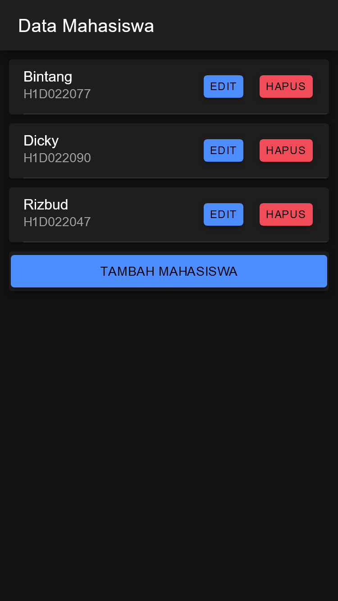
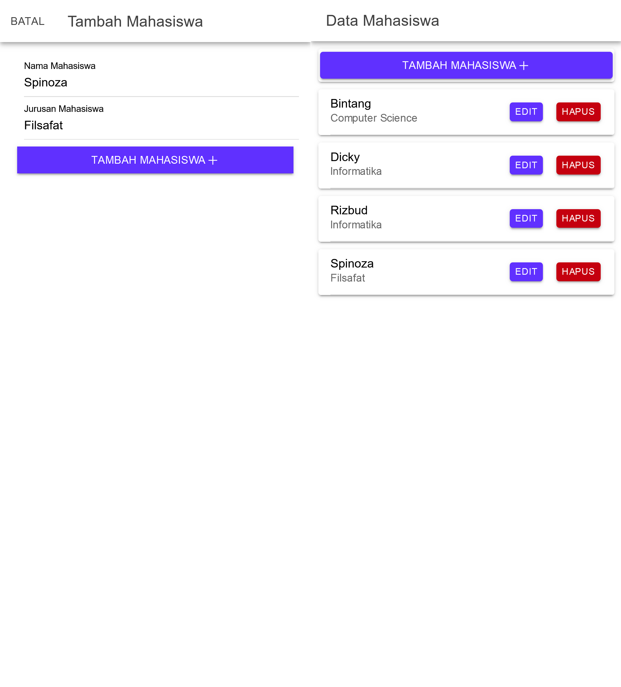
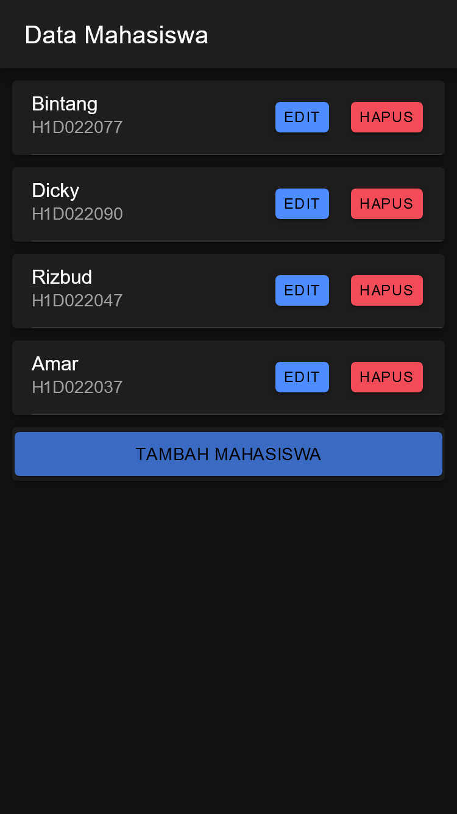
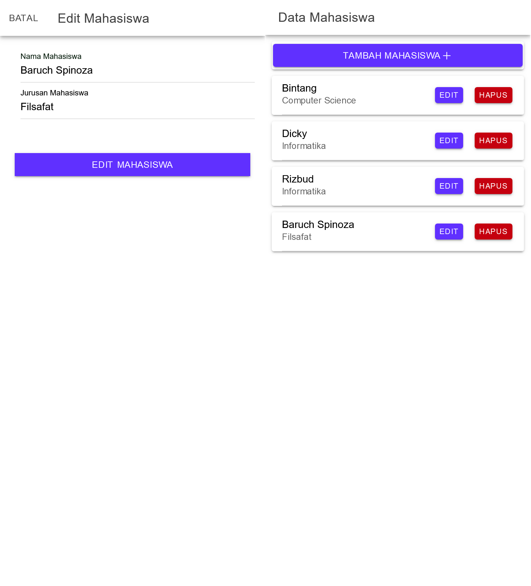
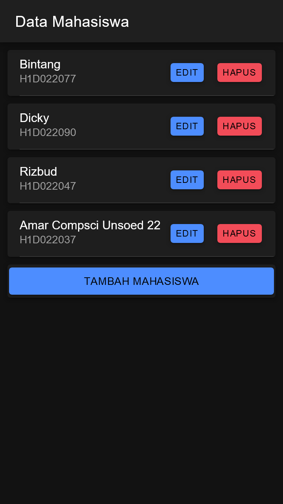
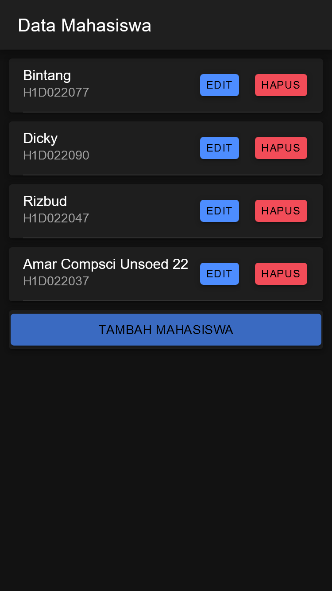

# Tugas 8 Praktikum Pemrograman Mobile

```yml
Nama: Panky Bintang Pradana Yosua
NIM: H1D022077
Shift Baru: F
Shift Lama: D
```

## Table of Contents

## 1. Routing

Routing Aplikasi didefinisikan pada file `src\app\app-routing.module.ts`

```ts
import { NgModule } from "@angular/core";
import { PreloadAllModules, RouterModule, Routes } from "@angular/router";

const routes: Routes = [
  {
    path: "home",
    loadChildren: () => import("./home/home.module").then((m) => m.HomePageModule),
  },
  {
    path: "",
    redirectTo: "home",
    pathMatch: "full",
  },
  {
    path: "mahasiswa",
    loadChildren: () => import("./mahasiswa/mahasiswa.module").then((m) => m.MahasiswaPageModule),
  },
];

@NgModule({
  imports: [RouterModule.forRoot(routes, { preloadingStrategy: PreloadAllModules })],
  exports: [RouterModule],
})
export class AppRoutingModule {}
```

## 2. API Service

API Service pada aplikasi ini memiliki 6 fungsi.

- apiURL:
  - Mengembalikan URL dasar API yang akan digunakan untuk setiap permintaan
  - Pengembalian: string - URL dasar API.
- tambah: Menambahkan data baru ke backend melalui metode HTTP POST.
- edit: Mengedit data di backend melalui metode HTTP PUT.
- tampil: Mengambil data dari backend melalui metode HTTP GET.
- hapus: Menghapus data di backend melalui metode HTTP DELETE.
- lihat: Menampilkan detail data tertentu berdasarkan id melalui metode HTTP GET.

```ts
import { Injectable } from "@angular/core";
import { HttpClient } from "@angular/common/http";
import { Observable } from "rxjs";

@Injectable({
  providedIn: "root",
})
export class ApiService {
  constructor(private http: HttpClient) {}

  apiURL() {
    return "http://localhost/ionic_crud";
  }

  tambah(data: any, endpoint: string) {
    return this.http.post(this.apiURL() + "/" + endpoint, data);
  }

  edit(data: any, endpoint: string) {
    return this.http.put(this.apiURL() + "/" + endpoint, data);
  }

  tampil(endpoint: string): Observable<any> {
    return this.http.get(this.apiURL() + "/" + endpoint);
  }

  hapus(id: any, endpoint: string) {
    return this.http.delete(this.apiURL() + "/" + endpoint + "" + id);
  }

  lihat(id: any, endpoint: string) {
    return this.http.get(this.apiURL() + "/" + endpoint + "" + id);
  }
}
```

## 3. Mahasiswa

### 3.1 Module Mahasiswa

Module mahasiswa memanggil `CommonModule`, `FormsModule`, `IonicModule`, dan `MahasiswaPageRoutingModule`, serta memiliki Page dalam declaration bernama `MahasiswaPage`.

```ts
import { NgModule } from "@angular/core";
import { CommonModule } from "@angular/common";
import { FormsModule } from "@angular/forms";

import { IonicModule } from "@ionic/angular";

import { MahasiswaPageRoutingModule } from "./mahasiswa-routing.module";

import { MahasiswaPage } from "./mahasiswa.page";

@NgModule({
  imports: [CommonModule, FormsModule, IonicModule, MahasiswaPageRoutingModule],
  declarations: [MahasiswaPage],
})
export class MahasiswaPageModule {}
```

### 3.2 Halaman Mahasiswa



### 3.2 Tambah Mahasiswa




### 3.3 Edit Mahasiswa




### 3.4 Hapus Mahasiswa


